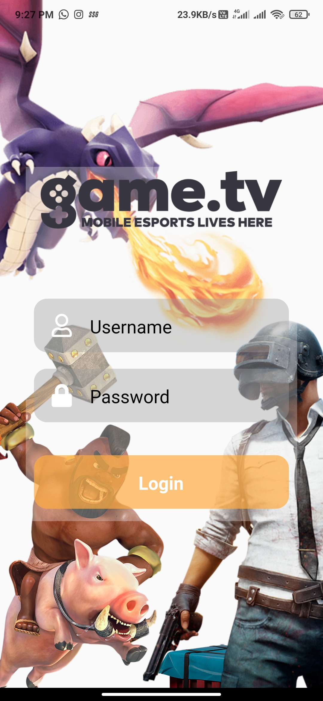
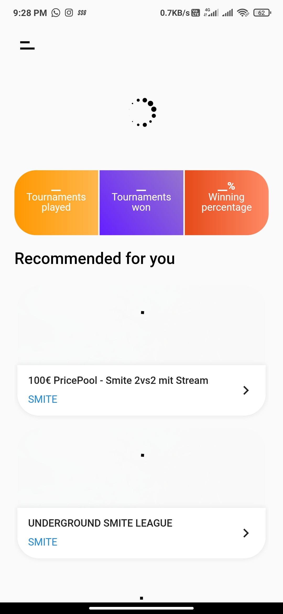
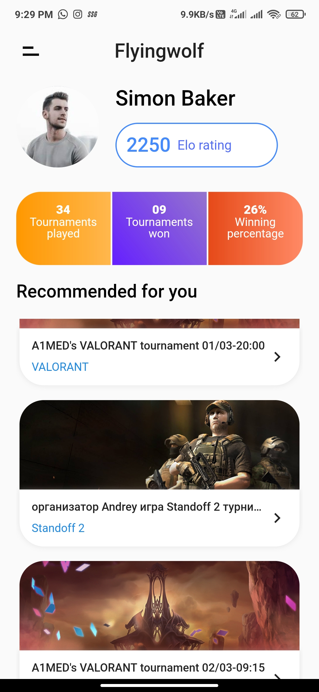
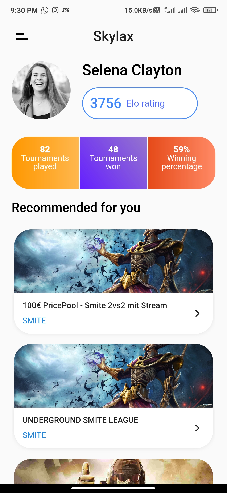
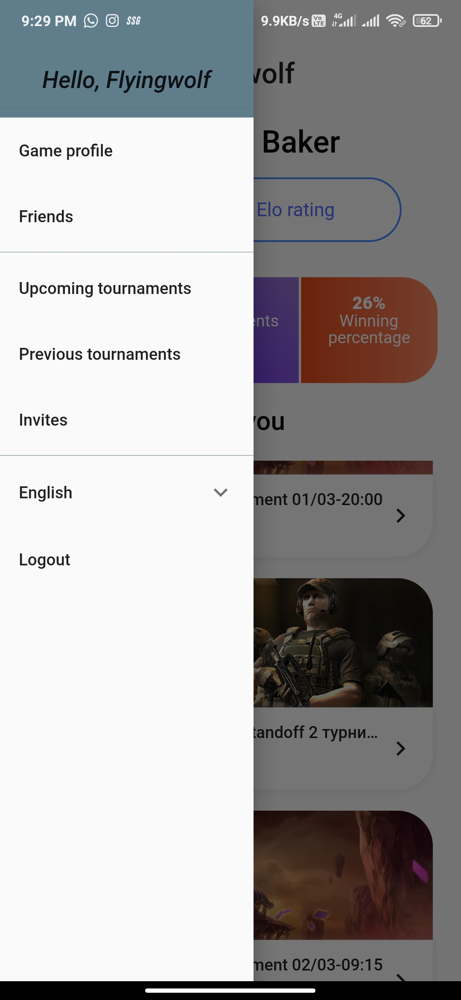
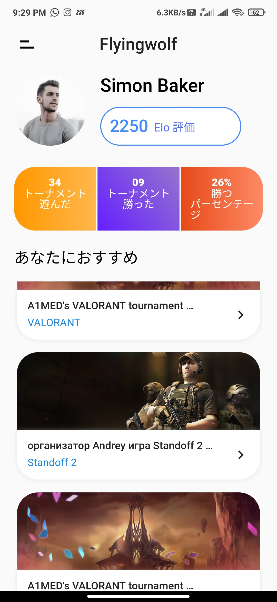
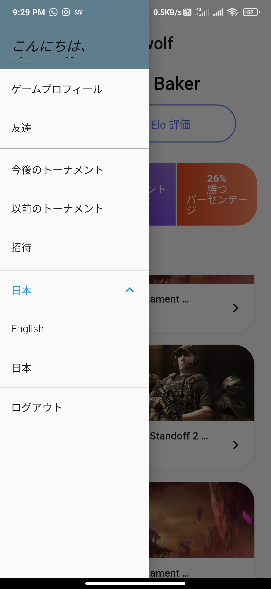

# mock game.tv

A 2-paged Flutter project, implementing mock presentation of game.tv app.
<br />




<br />
<br />
<br />
<br />
<br />
<br />
<br />
<br />
<br />
<br />
<br />
<br />
<br />
<br />
<br />
<br />
<br />
<br />
<br />
<br />
<br />
<br />
<br />
<br />
<br />
<br />

## 1. Login
Takes username and password for the login task. Basic validation is performed on the input and the authorization is provided through hard-coded credentials.

Wrapper is passed to the material app which keeps  the check on the logged status.
```buildoutcfg
'incorpa' : 'y8xs95zv',
'scriona' : 's3owzfwx'
```
<br />



<br />
<br />
<br />
<br />
<br />
<br />
<br />
<br />
<br />
<br />
<br />
<br />
<br />
<br />
<br />
<br />
<br />
<br />
<br />
<br />
<br />
<br />
<br />
<br />
<br />

---
## 2. Home
The user details are retrieved from the custom API (<https://github.com/divy2209/game.tv_api>) and displayed in the UI under future builder.

The tournament details are fetched from another API, with result limit and a string cursor, enabling for pagination view.
UI showing the tournaments details was enabled with infinite scrolling along with pagination.



Drawer was added with a custom icon, containing mock connections. Drawer contains the logout navigation.

<br />
<br />
<br />
<br />
<br />
<br />
<br />
<br />
<br />
<br />
<br />
<br />
<br />
<br />
<br />
<br />
<br />
<br />
<br />
<br />
<br />
<br />
<br />




<br />
<br />
<br />
<br />
<br />
<br />
<br />
<br />
<br />
<br />
<br />
<br />
<br />
<br />
<br />
<br />
<br />
<br />
<br />
<br />
<br />
<br />
<br />
<br />
<br />

The app is Localised with English(en) and Japanese(ja), the language change option is provided in the drawer.

"There persists a bug in localization, it's temporary. It resets after logging out or closing the app." - needs to be fixed!